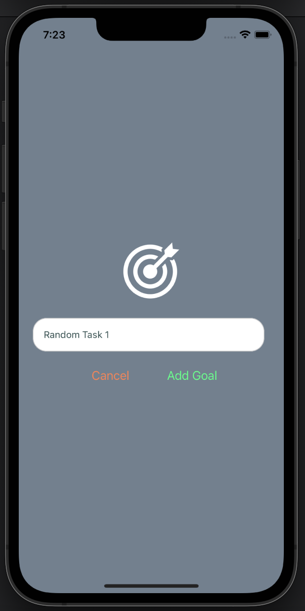
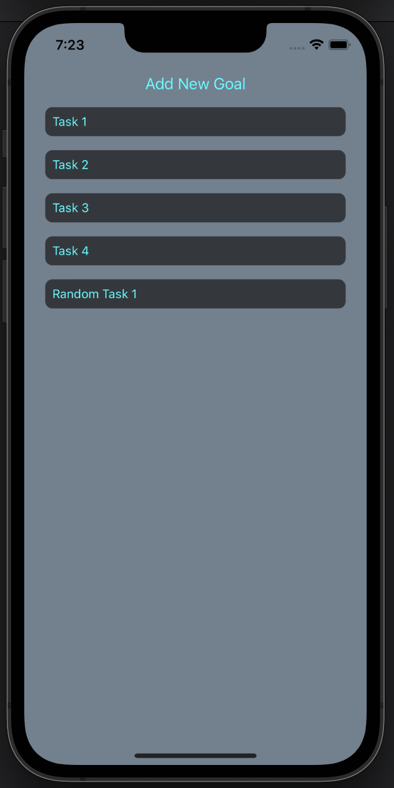

# React Native To-Do App

This is a simple to-do app built using React Native. The app allows you to add, view, and delete tasks.

## Features

- Add new goals/tasks by clicking on the "Add New Goal" button.
- Enter the task details in the input field that appears.
- Press the "Add" button to add the task to the list.
- The added tasks will be displayed in a scrollable list below the input field.
- Each task item in the list has a delete button associated with it.
- Clicking on the delete button will remove the task from the list.

## Usage

1. Clone or download the project repository.
2. Install the necessary dependencies using a package manager like npm or yarn.
3. Run the app on an emulator, simulator, or physical device using the appropriate commands for your development environment.

## Screenshots

 

## Technologies Used

- React Native
- Expo
- JavaScript

## Getting Started

To run the app locally, follow these steps:

1. Install [Node.js](https://nodejs.org) on your machine.
2. Clone or download the project repository.
3. Open a terminal and navigate to the project directory.
4. Run `npm install` or `yarn install` to install the dependencies.
5. Start the app with `npm start` or `yarn start`.
6. Use a compatible development environment or an emulator to run the app.

## Contributions

Contributions to the project are welcome! If you find any issues or want to add new features, feel free to submit a pull request.
